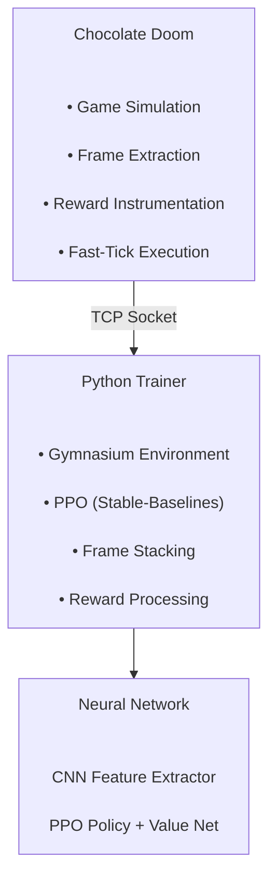

# 🎮 DoomRL: Reinforcement Learning Experiments in Chocolate Doom

<div align="center">

### Teaching a Neural Network to Survive in Doom

*An experimental reinforcement learning environment built by instrumenting Chocolate Doom and exposing it to Python-based PPO training.*


</div>

---

## ✨ Overview

This project explores how a classic game engine can be transformed into a reinforcement learning environment.

Using a modified build of **Chocolate Doom**, I implemented a lightweight instrumentation layer that:

* Captures game state and rendered frames
* Exposes observations to a Python training process
* Accepts agent actions in real time
* Runs the simulation uncapped for accelerated training
* Provides reward signals based on combat, exploration, and progression

The goal was not to create a production-grade RL benchmark, but rather to understand:

* Game engine internals
* Reinforcement learning pipelines
* Environment design
* Reward shaping
* Simulator throughput optimization

---

## 📸 Architecture



---

## 🧠 Observation Space

The agent receives:

### Visual Input

* Grayscale game frames
* Resolution reduced for training efficiency
* Frame stacking for temporal awareness

```text
Shape:
(4, 100, 160)

Meaning:
4 consecutive grayscale frames
```

This allows the agent to infer:

* Movement
* Enemy locations
* Projectiles
* Spatial layout

without direct access to internal game state.

---

## 🎯 Action Space

The policy outputs continuous actions:

| Action           | Description                 |
| ---------------- | --------------------------- |
| Forward/Backward | Move along facing direction |
| Strafe           | Move sideways               |
| Turn             | Rotate view                 |
| Attack           | Fire weapon                 |
| Use              | Interact with environment   |

Actions are converted into native Doom input commands before being injected into the engine.

---

## ⚡ Fast Simulation Mode

A major objective of the project was increasing training throughput.

The engine can operate in an **uncapped simulation mode**, bypassing normal frame pacing and advancing game ticks as quickly as the CPU allows.

Benefits:

* More experience per second
* Faster policy iteration
* Reduced wall-clock training time

This is often one of the most important optimizations in RL environments.

---

## 📊 Instrumentation

The modified engine tracks a variety of gameplay metrics.

### Combat

* Damage dealt
* Damage taken
* Kill count
* Ammunition consumption

### Exploration & Progress

* Door interactions
* Keycard collection
* Weapon pickups
* Health pickups
* Armor pickups
* Episode completion

### Spatial Information

* Player velocity
* Position
* Enemy-relative metrics used for reward shaping

---

## 🏆 Reward Design

The reward function combines several objectives:

### Positive Rewards

✅ Eliminating enemies

✅ Dealing damage

✅ Collecting key progression items

✅ Interacting with the environment

✅ Completing levels

### Negative Rewards

❌ Taking damage

❌ Dying

❌ Repeatedly visiting the same locations

❌ Wasting ammunition

The reward system evolved through experimentation and should be viewed as a learning exercise rather than a finalized design.

---

## 🏗️ Technical Stack

### Engine Side

* Chocolate Doom
* C99
* SDL

### Training Side

* Python 3.13
* Gymnasium
* Stable-Baselines3
* PyTorch
* OpenCV
* TensorBoard

---

## 🔬 What I Learned

This project taught me considerably more about environment engineering than about neural networks themselves.

Some key lessons:

* RL performance is heavily influenced by simulator design.
* Observation and reward engineering matter as much as model architecture.
* Throughput often becomes a bigger bottleneck than learning algorithms.
* Small reward-design decisions can dramatically change learned behavior.
* Instrumenting existing software systems is often harder than training the model.

---

## 🚧 Current Status

**Project Status:** Archived / Experimental

Development has been paused while I explore other projects and areas of interest.

The environment functions as a proof-of-concept and learning platform rather than a finished research artifact.

Future work could include:

* More sophisticated reward shaping
* Additional environment instrumentation
* Better episode management
* Multi-level training
* Alternative RL algorithms
* Improved observation pipelines

---

## 📚 Motivation

I built this project primarily to better understand:

* Reinforcement learning
* Game engine architecture
* Simulation environments

Classic Doom provides a surprisingly rich playground for experimentation, and modifying an existing engine proved to be an excellent way to learn how RL environments are constructed from the ground up.

---

<div align="center">

### Built for learning, experimentation, and curiosity.

*"The neural network did not become the Doom Slayer.<br>
It mostly learned new and inventive ways to run into walls, and hack my rewards."*

</div>
